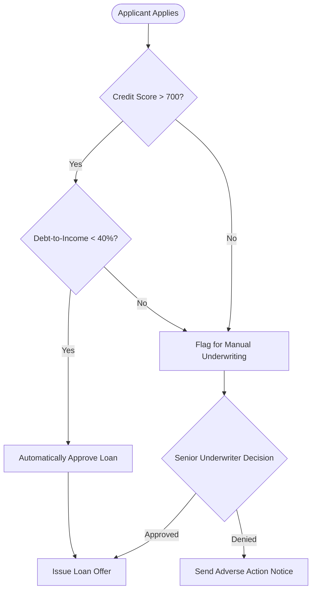

# Loan Eligibility Decision Flow

This flowchart demonstrates a complex decision process using conditional branches, manual underwriting, and final approval or rejection paths.

```mermaid
flowchart TD
    Start([Applicant Applies]) --> CheckCredit{Credit Score > 700?}

    CheckCredit -- Yes --> CheckIncome{Debt-to-Income < 40%?}
    CheckCredit -- No --> ManualReview[Flag for Manual Underwriting]

    CheckIncome -- Yes --> AutoApprove[Automatically Approve Loan]
    CheckIncome -- No --> ManualReview

    ManualReview --> SeniorReview{Senior Underwriter Decision}
    SeniorReview -- Approved --> SendOffer[Issue Loan Offer]
    SeniorReview -- Denied --> SendRejection[Send Adverse Action Notice]

    AutoApprove --> SendOffer
```